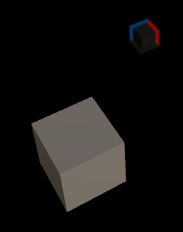

# Unity Camera Movement Template

This is a template Assets file for Unity that contains a 3D scene with a moveable camera. This is mainly made for universe-like sandbox games/applications with a full range of motion and rotation.

## What is this?

This repo contains an "Assets" file. You should be able to replace your Assets file with this one. Then double-click the Scene "Main" to open it. It's been made using version 21.3.20f1 with URP, so make sure to use this if you're encountering any issues. 

### The scene

The scene contains the following:
- Main camera with a light object
- RotatePoint, which is the object that the camera will rotate around when right-clicking
- Global Volume, which is some URP stuff idrk
- A sample cube object. You can delete this without problem, it's just there so that the scene isn't completely empty. 

The Main Camera contains the CameraMovement class. There you can set, for example, the sensitivies or how far away the target will be from the camera. 

## Features

### Movement

You can move the camera using WASD and QA, or the arrow keys and shift and control. You can also use the mouse wheel to move the camera forwards and backwards, or left and right if you're able to scroll vertically. 

### Rotation

If you press left, right or middle click the cursor will be locked. If you let go, the cursor will return to the original position in Windows and into the middle of the window in other operating systems. 

There are three different types of rotations:
1. Rotation (left click): This rotates the camera like in a first-person-shooter.
2. Rotation around target (right click). This will rotate the camera around the target object that's shown when you do said movement.
3. Panning (middle click): Pans the camera like it's a 2D scene.
   

